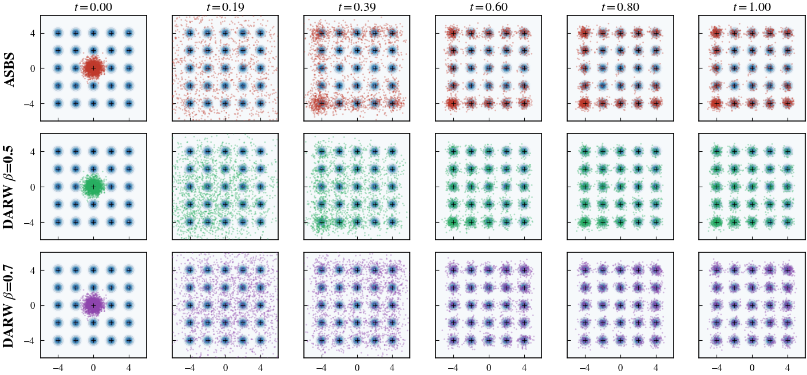

# Grid25 Evaluation Results

## Benchmark: Grid25 (5×5 Gaussian Mixture, 25 modes)

- **Target:** 25-mode equal-weight GMM on a 5×5 grid with centers at {−4,−2,0,2,4}², σ=0.3
- **Source:** N(0, 0.5²I)
- **SDE:** Variance Exploding, NFE=100, σ_max=6, σ_min=0.01
- **Training:** 3000 epochs, FourierMLP controller
- **Evaluation samples:** 2000 per seed, 3 seeds per method
- **Reference mean energy:** 1.0156

## Metrics (mean ± std over 3 seeds)

| Metric | ASBS | DARW β=0.5 | DARW β=0.7 |
|---|---|---|---|
| Mode Weight TV ↓ | 0.2537 ± 0.0748 | 0.1623 ± 0.0362 | **0.0950 ± 0.0153** |
| Energy W2 ↓ | **0.1002 ± 0.0337** | 0.1901 ± 0.0208 | 0.3059 ± 0.0290 |
| W2 Distance ↓ | 1.7674 ± 0.2896 | 1.2705 ± 0.2995 | **0.7362 ± 0.1492** |
| Sinkhorn Div ↓ | 3.1444 ± 0.9696 | 1.7484 ± 0.7724 | **0.6294 ± 0.2203** |
| KL Divergence ↓ | 2.4062 ± 0.4650 | **2.1775 ± 0.0790** | 2.2272 ± 0.0832 |
| Mean Energy (ref=1.0156) | **1.0711 ± 0.0291** | 1.1681 ± 0.0247 | 1.2500 ± 0.0251 |
| Std Energy | 1.0800 ± 0.0322 | 1.1391 ± 0.0008 | 1.2210 ± 0.0152 |
| ESS ↑ | **7.9673 ± 1.2552** | 4.6708 ± 2.6332 | 2.1678 ± 0.2232 |
| ESS % ↑ | **0.3984 ± 0.0628** | 0.2335 ± 0.1317 | 0.1084 ± 0.0112 |

## Marginal Evolution (NeurIPS style)

*Rows: ASBS, DARW β=0.5, DARW β=0.7. Columns: time snapshots from t=0 (source) to t=1 (target). Blue contours show the target density. Seed 0 used for visualization.*

## Observations

- **DARW β=0.7** achieves the best mode balance (Mode Weight TV: 0.095), W2 distance (0.736), and Sinkhorn divergence (0.629) — substantially outperforming vanilla ASBS on distributional metrics.
- **Vanilla ASBS** has the best mean energy (closest to reference) and highest ESS, indicating samples land near modes but with uneven coverage.
- **KL divergence** is similar across all methods (~2.2), suggesting comparable local density quality.
- Higher DARW β improves mode coverage at the cost of ESS — a tradeoff between distributional fidelity and importance weight efficiency.
