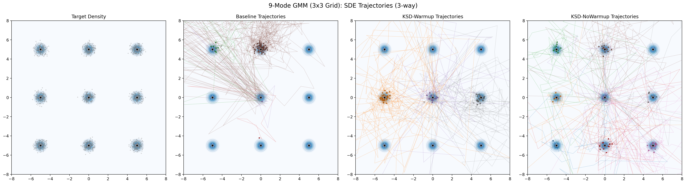
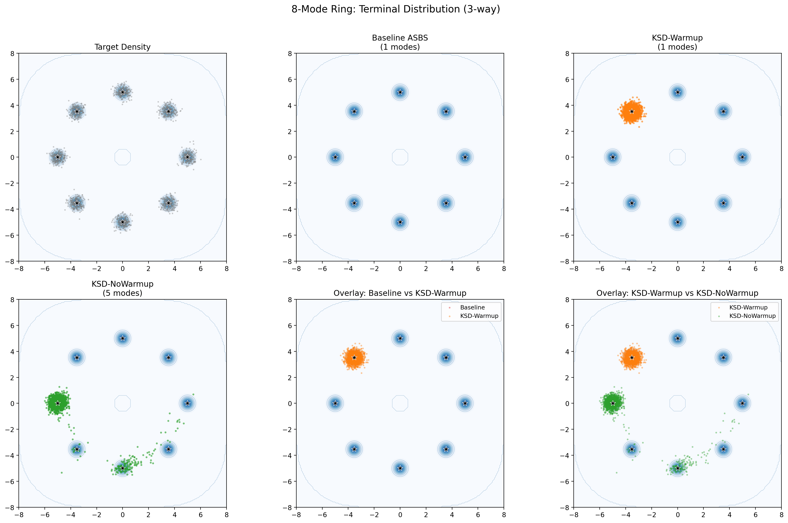
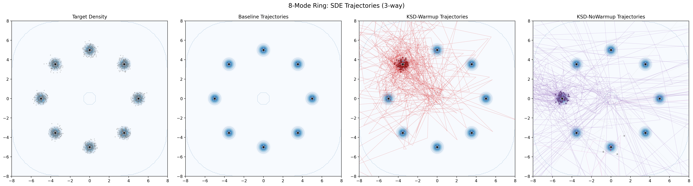

# 2D Visualization Benchmark Results

Generated: 2026-04-07 05:51:24 KST

---

## 9-Mode GMM (3x3 Grid)

| Metric | Baseline ASBS | KSD-Warmup (lambda=0.01) | KSD-NoWarmup (lambda=0.01) |
|---|---|---|---|
| Modes covered (of 9) | 5 | 3 | 8 |
| Mean energy | 1.2632 | 1.0361 | 1.0165 |
| Std energy | 1.2876 | 1.0972 | 1.0296 |
| Per-mode counts | [0, 7, 213, 30, 99, 1595, 0, 0, 0] | [0, 982, 0, 0, 308, 0, 0, 680, 0] | [185, 223, 152, 260, 170, 344, 364, 275, 0] |

### Terminal Distribution

### SDE Trajectories

---

## 8-Mode Ring

| Metric | Baseline ASBS | KSD-Warmup (lambda=0.1) | KSD-NoWarmup (lambda=0.1) |
|---|---|---|---|
| Modes covered (of 8) | 1 | 1 | 5 |
| Mean energy | nan | 1.0405 | 985601.2500 |
| Std energy | nan | 1.0620 | 8266519.0000 |
| Per-mode counts | [2000, 0, 0, 0, 0, 0, 0, 0] | [0, 0, 0, 1972, 0, 0, 0, 0] | [1, 0, 0, 0, 1628, 15, 106, 3] |

### Terminal Distribution

### SDE Trajectories

---

