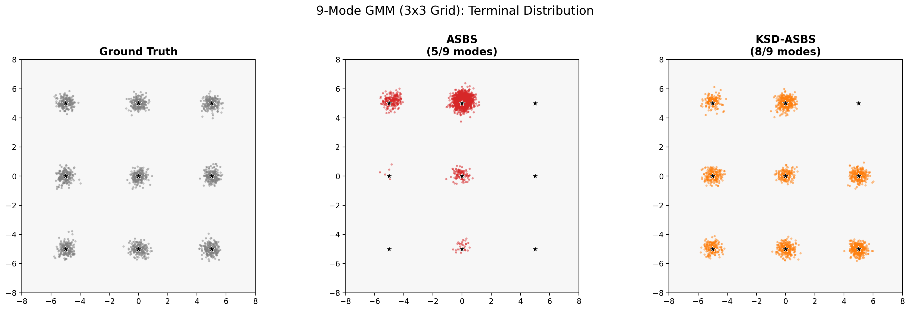
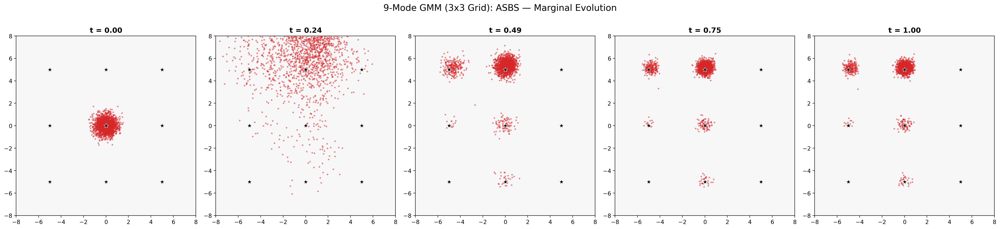

# 2D Visualization Benchmark Results

Generated: 2026-04-07 07:01:29 KST

---

## 9-Mode GMM (3x3 Grid)

| Metric | ASBS (Baseline) | KSD-ASBS (lambda=0.01) |
|---|---|---|
| Modes covered (of 9) | 5 | 8 |
| Mean energy | 1.2632 | 1.0165 |
| Std energy | 1.2876 | 1.0296 |
| Per-mode counts | [0, 7, 213, 30, 99, 1595, 0, 0, 0] | [185, 223, 152, 260, 170, 344, 364, 275, 0] |

### Terminal Distribution

### Marginal Evolution: ASBS

### Marginal Evolution: KSD-ASBS

---
