# 2D Visualization Benchmark Results

Generated: 2026-04-07 08:29:33 KST

---

## 9-Mode GMM (3x3 Grid)

| Metric | ASBS (Baseline) | KSD-ASBS (lambda=0.01) |
|---|---|---|
| Modes covered (of 9) | 5 | 8 |
| Mean energy | 1.2632 | 1.0165 |
| Std energy | 1.2876 | 1.0296 |
| Per-mode counts | [0, 7, 213, 30, 99, 1595, 0, 0, 0] | [185, 223, 152, 260, 170, 344, 364, 275, 0] |

### Terminal Distribution

### Marginal Evolution: ASBS

### Marginal Evolution: KSD-ASBS

---

## 9-Mode GMM (3x3 Grid) — Seed 1

Evaluated: 2026-04-07 09:06:12 KST | Checkpoint: latest (~ep 2316, early-stopped)

| Metric | ASBS (Baseline) | KSD-ASBS (lambda=0.01) |
|---|---|---|
| Modes covered (of 9) | 9 | 9 |
| Mean energy | 1.0573 | 1.0621 |
| Std energy | 1.0890 | 1.2858 |
| Per-mode counts | [60, 110, 1066, 25, 35, 253, 44, 73, 302] | [341, 317, 697, 94, 98, 191, 71, 62, 99] |

### Terminal Distribution

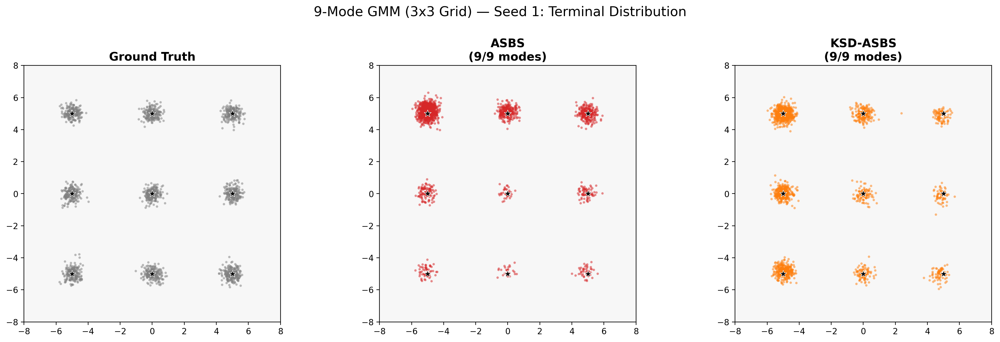

### Marginal Evolution: ASBS

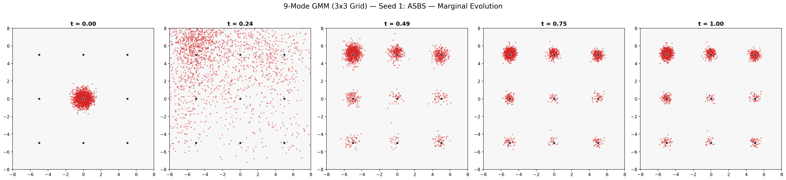

### Marginal Evolution: KSD-ASBS

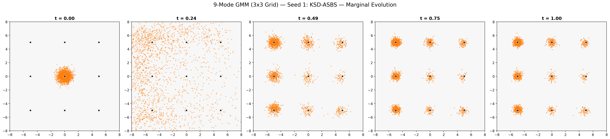

---

## Two Moons

| Metric | ASBS (Baseline) | KSD-ASBS (lambda=0.01) |
|---|---|---|
| Modes covered (of 2) | 2 | 2 |
| Mean energy | 0.1167 | 0.0779 |
| Std energy | 0.7577 | 0.6791 |
| Per-mode counts | [895, 1102] | [1175, 821] |

### Terminal Distribution

### Marginal Evolution: ASBS

### Marginal Evolution: KSD-ASBS

---

## Checkerboard (4x4)

| Metric | ASBS (Baseline) | KSD-ASBS (lambda=0.1) |
|---|---|---|
| Modes covered (of 8) | 8 | 8 |
| Mean energy | 0.8375 | 0.8239 |
| Std energy | 1.1476 | 1.1650 |
| Per-mode counts | [64, 133, 95, 103, 70, 103, 76, 73] | [74, 107, 85, 87, 92, 97, 95, 78] |

### Terminal Distribution

### Marginal Evolution: ASBS

### Marginal Evolution: KSD-ASBS

---

## Spiral

| Metric | ASBS (Baseline) | KSD-ASBS (lambda=0.01) |
|---|---|---|
| Modes covered (of 20) | 19 | 20 |
| Mean energy | 0.5350 | 0.5466 |
| Std energy | 0.7754 | 0.8608 |
| Per-mode counts | [6, 13, 13, 8, 24, 21, 19, 19, 5, 7, 5, 7, 31, 98, 165, 149, 136, 123, 19, 0] | [20, 31, 25, 41, 49, 48, 39, 36, 30, 82, 119, 128, 130, 71, 62, 68, 53, 34, 34, 54] |

### Terminal Distribution

### Marginal Evolution: ASBS

### Marginal Evolution: KSD-ASBS

---
## 25-Mode Grid (5×5)

| Metric | ASBS (Baseline) | SDR-ASBS (λ=0.1) |
|---|---|---|
| Modes covered (of 25) | 25 | 25 |
| Mean energy | 1.0373 | 1.0327 |
| Std energy | 1.0660 | 1.0167 |
| KL divergence | 2.0499 | 2.1956 |
| W₂ distance | 2.1668 | 1.1025 |
| Sinkhorn divergence | 3.4123 | 1.2662 |
| Mode weight TV | 0.3035 | 0.1503 |
| ESS | 3.8 (0.19%) | 3.7 (0.19%) |
| Per-mode counts | [13, 17, 53, 93, 159, 20, 25, 64, 113, 164, 20, 42, 67, 140, 173, 17, 34, 70, 104, 135, 18, 43, 85, 126, 166] | [61, 69, 106, 143, 227, 65, 53, 61, 84, 75, 49, 50, 65, 98, 71, 62, 67, 71, 65, 47, 74, 89, 81, 98, 38] |

### Terminal Distribution

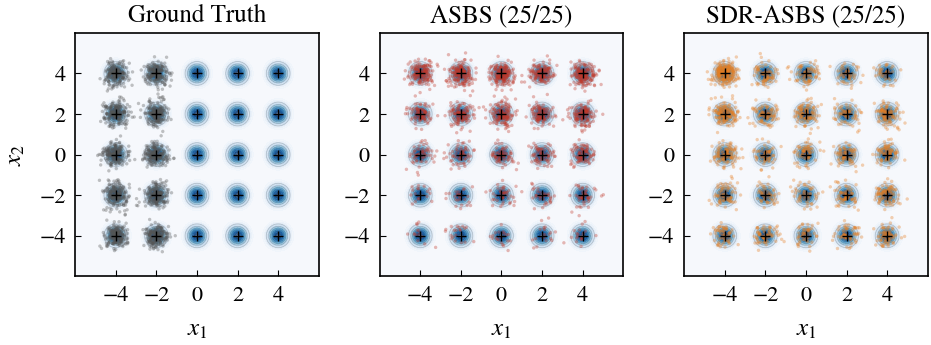

### Marginal Evolution: ASBS

### Marginal Evolution: SDR-ASBS

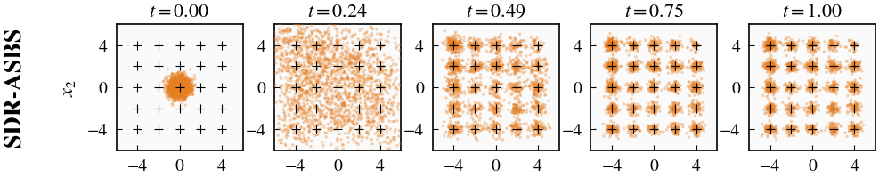

---

## 25-Mode Grid — ASBS 3-Seed Evaluation

Evaluated: 2026-04-08 07:12:34 KST

| Metric | Seed 0 | Seed 1 | Seed 2 | Mean ± Std |
|---|---|---|---|---|
| Modes covered (of 25) | 25 | 10 | 25 | 20.0 ± 7.1 |
| Mean energy | 1.9985 | 42181872.0000 | 42.9796 | 14060638.9927 ± 19884714.5548 |
| Std energy | 1.7637 | 120698752.0000 | 998.0815 | 40233250.6151 ± 56897701.6823 |
| KL divergence | 2.6559 | -0.0021 | 3.3248 | 1.9929 ± 1.4368 |
| W₂ distance | 1.3709 | 674.4346 | 5.2233 | 227.0096 ± 316.3812 |
| Sinkhorn divergence | 1.9192 | 0.0003 | 0.0005 | 0.6400 ± 0.9045 |
| Mode weight TV | 0.2570 | 0.7774 | 0.7168 | 0.5837 ± 0.2324 |
| ESS | 3.9 (0.19%) | 1.9 (0.10%) | 4.8 (0.24%) | 3.5 (0.18% ± 0.06%) |
| Per-mode counts (seed 0) | [58, 77, 99, 107, 149, 35, 27, 28, 54, 91, 31, 19, 28, 28, 61, 56, 40, 33, 43, 63, 79, 80, 97, 138, 240] | | | |
| Per-mode counts (seed 1) | | [0, 0, 0, 0, 0, 0, 0, 0, 0, 0, 0, 0, 0, 0, 0, 5, 2, 5, 7, 3, 105, 70, 99, 303, 376] | | |
| Per-mode counts (seed 2) | | | [4, 4, 16, 25, 284, 4, 4, 9, 13, 157, 5, 2, 6, 14, 229, 3, 2, 3, 12, 247, 3, 3, 1, 12, 680] | |

### Seed 0

#### Terminal Distribution
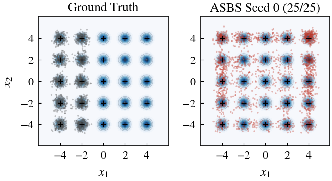

#### Marginal Evolution
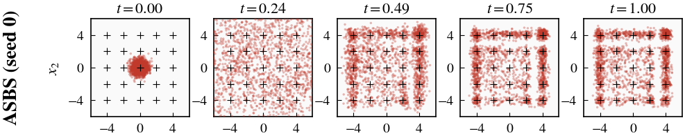

#### KDE Density
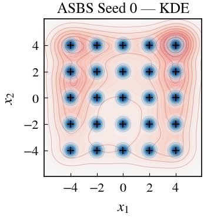

### Seed 1

#### Terminal Distribution
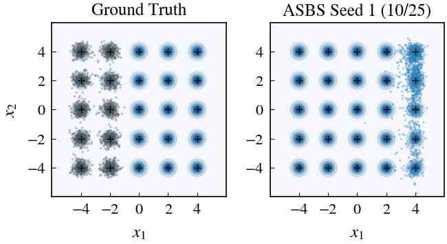

#### Marginal Evolution
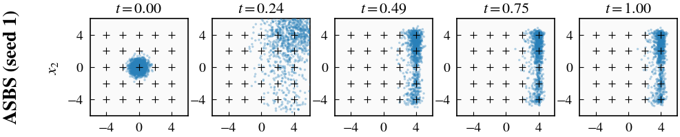

#### KDE Density
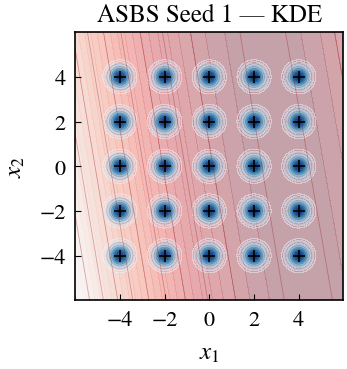

### Seed 2

#### Terminal Distribution
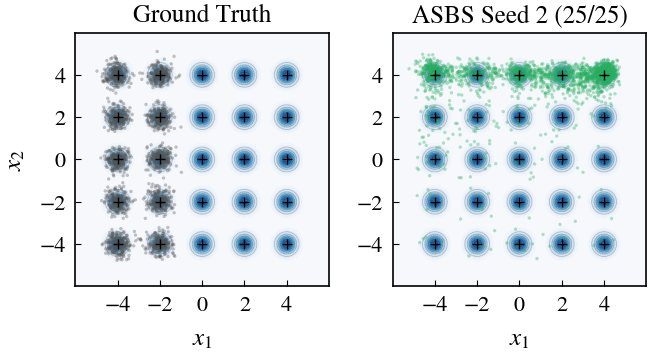

#### Marginal Evolution
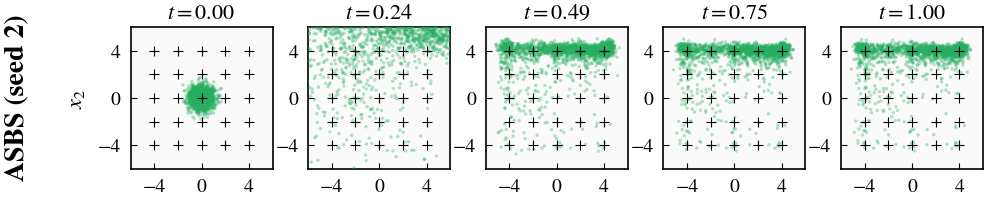

#### KDE Density
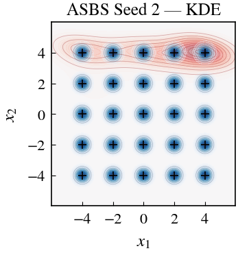

---

## 25-Mode Grid — ASBS Seed 5 (Diverged)

Evaluated: 2026-04-08 23:14 KST | Checkpoint: 800 (last valid before divergence at ~epoch 867)

Seed 5 diverged during training — adjoint loss exploded from ~8 to 1e15 then NaN at epoch ~867.
Below is the marginal evolution from checkpoint_800.pt, the last valid checkpoint.

#### Marginal Evolution: ASBS Seed 5 (ckpt 800)

---

## 25-Mode Grid — Baseline Comparison

Evaluated: 2026-04-07 23:06:56 KST

Methods: ASBS, SDR-ASBS (λ=0.1), AS (Adjoint Sampler), DGFS (GFlowNet), iDEM, pDEM

| Metric | ASBS | SDR-ASBS | AS | DGFS | iDEM | pDEM |
|---|---|---|---|---|---|---|
| Modes covered (of 25) | 25 | 25 | 25 | 17 | 22 | 22 |
| Mean energy | 1.0373 | 1.0327 | 1.1450 | 3.5238 | 0.9330 | 1.0185 |
| Std energy | 1.0660 | 1.0167 | 1.2024 | 2.2148 | 0.9276 | 1.0140 |
| KL divergence | 2.0499 | 2.1956 | 2.5769 | 2.9108 | 1.6091 | 1.6380 |
| W₂ distance | 2.1672 | 1.1113 | 1.2651 | 2.4011 | 2.3014 | 2.2773 |
| Sinkhorn divergence | 3.4227 | 1.2849 | 1.6488 | 5.3930 | 5.3452 | 5.2375 |
| Mode weight TV | 0.3035 | 0.1503 | 0.2207 | 0.6568 | 0.6014 | 0.5970 |

### Terminal Distribution Comparison

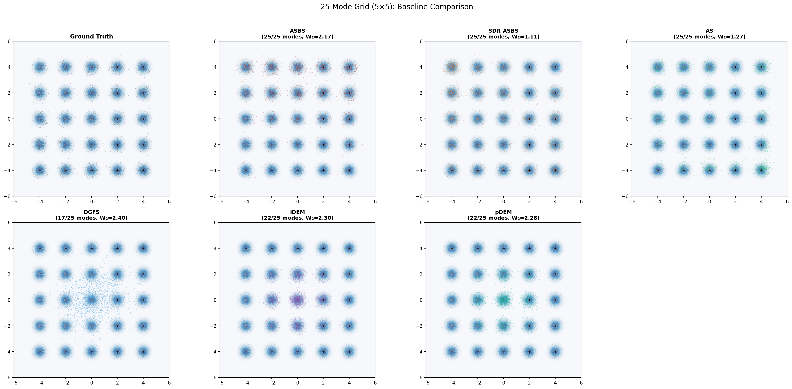

---
