# 2D Visualization Benchmark Results

Generated: 2026-04-07 08:29:33 KST

---

## 9-Mode GMM (3x3 Grid)

| Metric | ASBS (Baseline) | KSD-ASBS (lambda=0.01) |
|---|---|---|
| Modes covered (of 9) | 5 | 8 |
| Mean energy | 1.2632 | 1.0165 |
| Std energy | 1.2876 | 1.0296 |
| Per-mode counts | [0, 7, 213, 30, 99, 1595, 0, 0, 0] | [185, 223, 152, 260, 170, 344, 364, 275, 0] |

### Terminal Distribution

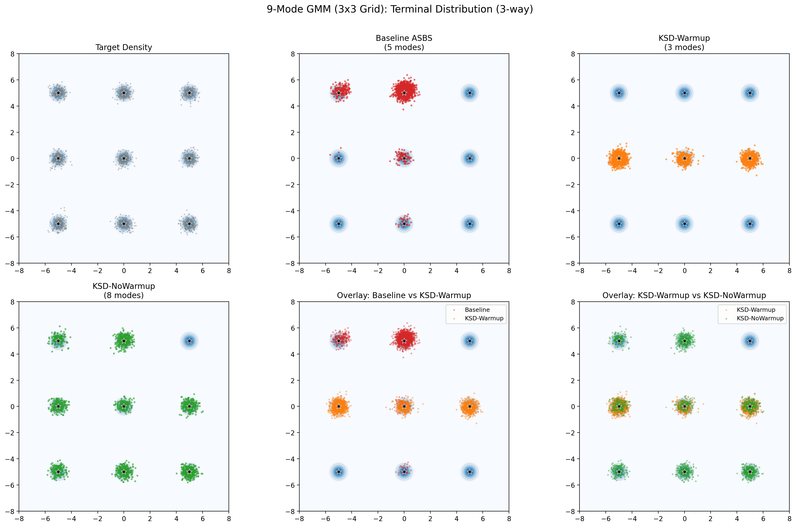

### Marginal Evolution: ASBS

### Marginal Evolution: KSD-ASBS

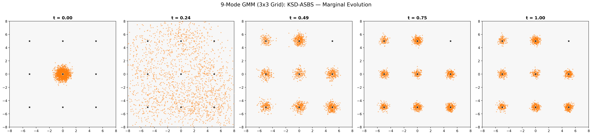

---

## Two Moons

| Metric | ASBS (Baseline) | KSD-ASBS (lambda=0.01) |
|---|---|---|
| Modes covered (of 2) | 2 | 2 |
| Mean energy | 0.1167 | 0.0779 |
| Std energy | 0.7577 | 0.6791 |
| Per-mode counts | [895, 1102] | [1175, 821] |

### Terminal Distribution

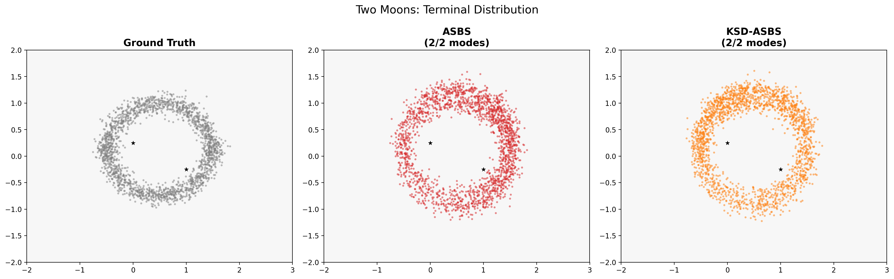

### Marginal Evolution: ASBS

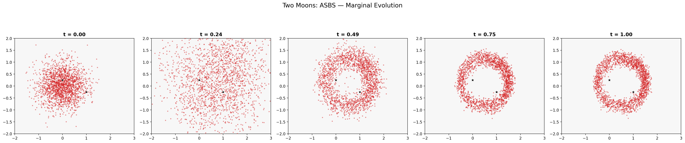

### Marginal Evolution: KSD-ASBS

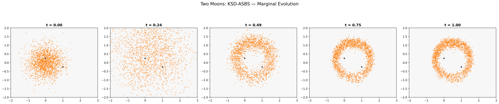

---

## Checkerboard (4x4)

| Metric | ASBS (Baseline) | KSD-ASBS (lambda=0.1) |
|---|---|---|
| Modes covered (of 8) | 8 | 8 |
| Mean energy | 0.8375 | 0.8239 |
| Std energy | 1.1476 | 1.1650 |
| Per-mode counts | [64, 133, 95, 103, 70, 103, 76, 73] | [74, 107, 85, 87, 92, 97, 95, 78] |

### Terminal Distribution

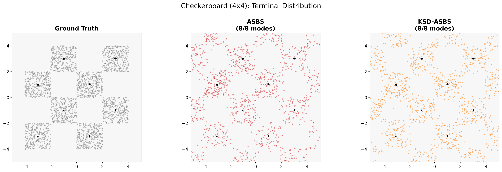

### Marginal Evolution: ASBS

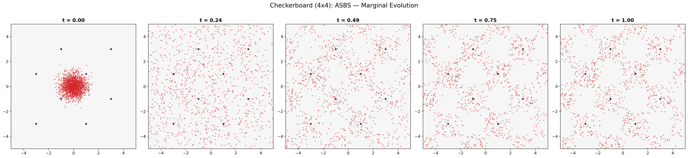

### Marginal Evolution: KSD-ASBS

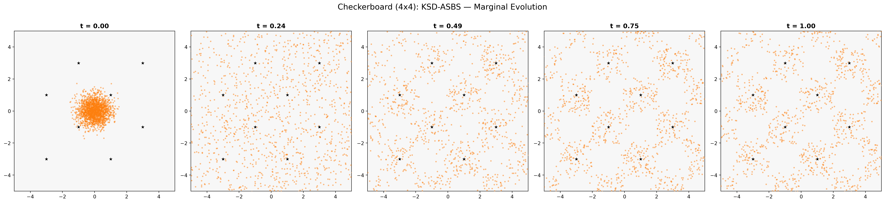

---

## Spiral

| Metric | ASBS (Baseline) | KSD-ASBS (lambda=0.01) |
|---|---|---|
| Modes covered (of 20) | 19 | 20 |
| Mean energy | 0.5350 | 0.5466 |
| Std energy | 0.7754 | 0.8608 |
| Per-mode counts | [6, 13, 13, 8, 24, 21, 19, 19, 5, 7, 5, 7, 31, 98, 165, 149, 136, 123, 19, 0] | [20, 31, 25, 41, 49, 48, 39, 36, 30, 82, 119, 128, 130, 71, 62, 68, 53, 34, 34, 54] |

### Terminal Distribution

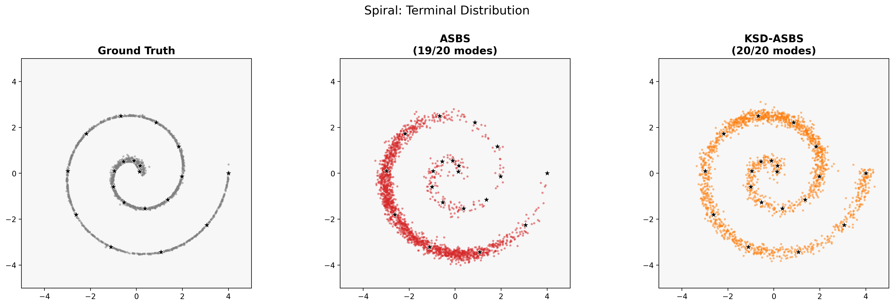

### Marginal Evolution: ASBS

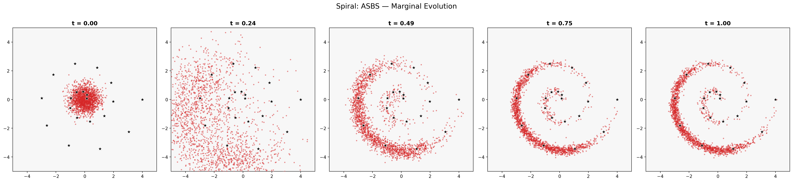

### Marginal Evolution: KSD-ASBS

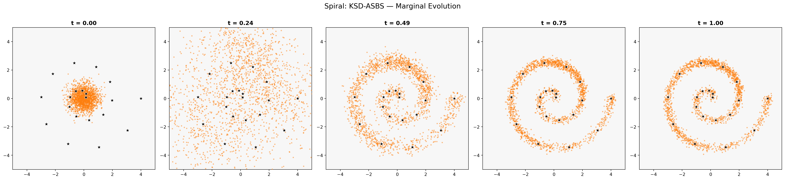

---

## Nested Rings

| Metric | ASBS (Baseline) | KSD-ASBS (lambda=0.1) |
|---|---|---|
| Modes covered (of 2) | 2 | 0 |
| Mean energy | 0.9022 | 2.3656 |
| Std energy | 0.9165 | 1.1847 |
| Per-mode counts | [26, 72] | [0, 0] |

### Terminal Distribution

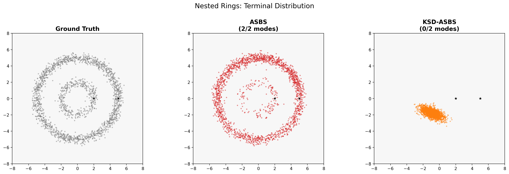

### Marginal Evolution: ASBS

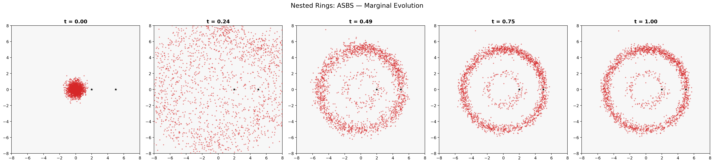

### Marginal Evolution: KSD-ASBS

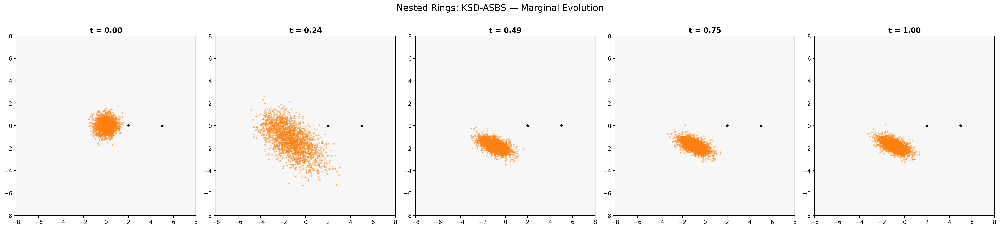

---

