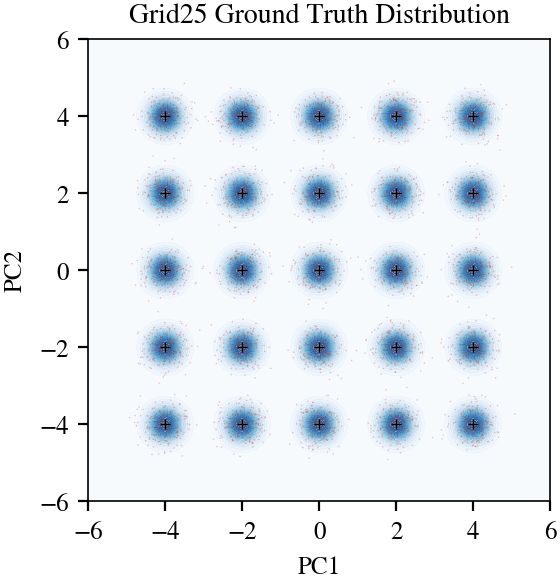

# ASBS Paper: Official Benchmark Results

## Table 1: Benchmark Comparisons

Comparison of sampling performance across various energy functions (Mixture of Gaussians, Double Well, and Lennard-Jones particles).

| Method | MW-5 (d=5) Sinkhorn ↓ | DW-4 (d=8) W₂ ↓ | DW-4 (d=8) E(·) W₂ ↓ | LJ-13 (d=39) W₂ ↓ | LJ-13 (d=39) E(·) W₂ ↓ | LJ-55 (d=165) W₂ ↓ | LJ-55 (d=165) E(·) W₂ ↓ |
|---|---|---|---|---|---|---|---|
| PDDS | — | 0.92±0.08 | 0.58±0.25 | 4.66±0.87 | 56.01±10.80 | — | — |
| SCLD | 0.44±0.06 | 1.30±0.64 | 0.40±0.19 | 2.93±0.19 | 27.98±1.26 | — | — |
| PIS | 0.65±0.25 | 0.68±0.28 | 0.65±0.25 | 1.93±0.07 | 18.02±1.12 | 4.79±0.45 | 228.70±131.27 |
| DDS | 0.63±0.24 | 0.92±0.11 | 0.90±0.37 | 1.99±0.13 | 24.61±8.99 | 4.60±0.09 | 173.09±18.01 |
| LV-PIS | — | 1.04±0.29 | 1.89±0.89 | — | — | — | — |
| iDEM | — | 0.70±0.06 | 0.55±0.14 | 1.61±0.01 | 30.78±24.46 | 4.69±1.52 | 93.53±16.31 |
| AS | 0.32±0.06 | 0.62±0.12 | 0.55±0.12 | 1.67±0.01 | 2.40±1.25 | 4.04±0.05 | 30.83±8.19 |
| **ASBS (Ours)** | **0.15±0.02** | **0.43±0.05** | **0.20±0.11** | **1.59±0.03** | **1.99±1.01** | **4.00±0.03** | **28.10±8.15** |

## Table 3: Molecular Boltzmann Distribution (Alanine Dipeptide)

Performance on sampling the molecular Boltzmann distribution. Metrics include KL divergence (D_KL) for 1D marginals of torsion angles and Wasserstein-2 (W₂) on the joint (φ, ψ) distribution.

| Method | φ (D_KL ↓) | ψ (D_KL ↓) | γ₁ (D_KL ↓) | γ₂ (D_KL ↓) | γ₃ (D_KL ↓) | (φ, ψ) (W₂ ↓) |
|---|---|---|---|---|---|---|
| PIS | 0.05±0.03 | 0.38±0.49 | 5.61±1.24 | 4.49±0.03 | 4.60±0.03 | 1.27±1.19 |
| DDS | 0.03±0.01 | 0.16±0.07 | 2.44±0.96 | 0.03±0.00 | 0.03±0.00 | 0.68±0.09 |
| AS | 0.09±0.09 | 0.04±0.04 | 0.17±0.17 | 0.56±0.09 | 0.51±0.06 | 0.65±0.52 |
| **ASBS (Ours)** | **0.02±0.00** | **0.01±0.00** | **0.03±0.01** | **0.02±0.00** | **0.02±0.00** | **0.25±0.01** |

---

# SDR Evaluation Results

## Grid25 (5x5 Gaussian mixture, 2D)

**Seeds:** 3 per method (mean +/- std) | **Samples:** 2000 | **Date:** 2026-04-14

| Metric | ASBS | SDR beta=0.5 | SDR beta=0.7 | SDR beta=1.0 |
|---|---|---|---|---|
| Mode Weight TV (lower is better) | 0.254 +/- 0.075 | 0.162 +/- 0.036 | **0.095 +/- 0.015** | 0.122 +/- 0.041 |
| Energy W2 (lower is better) | **0.135 +/- 0.032** | 0.223 +/- 0.021 | 0.326 +/- 0.027 | 0.537 +/- 0.147 |
| W2 Distance (lower is better) | 1.768 +/- 0.287 | 1.273 +/- 0.299 | **0.737 +/- 0.151** | 0.876 +/- 0.361 |
| Sinkhorn Divergence (lower is better) | 3.140 +/- 0.959 | 1.752 +/- 0.770 | **0.631 +/- 0.224** | 0.962 +/- 0.689 |
| KL Divergence (lower is better) | 2.406 +/- 0.465 | **2.178 +/- 0.079** | 2.227 +/- 0.083 | 2.259 +/- 0.102 |

