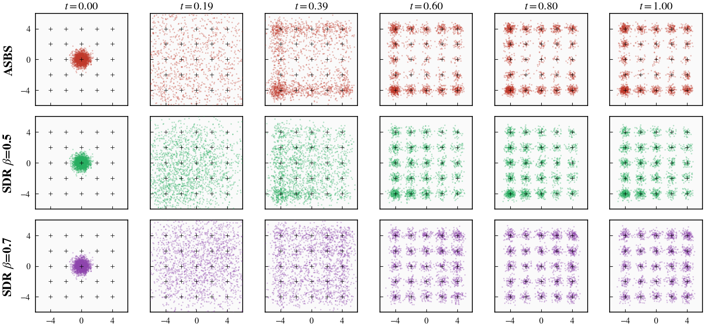

# Grid25 Evaluation Results

- 2000 samples/seed, 3 seeds/method, ref mean energy = 1.0156

## Metrics (mean ± std over 3 seeds)

| Metric | ASBS | SDR β=0.5 | SDR β=0.7 |
|---|---|---|---|
| Mode Weight TV ↓ | 0.2537 ± 0.0748 | 0.1623 ± 0.0362 | **0.0950 ± 0.0153** |
| Energy W2 ↓ | **0.1002 ± 0.0337** | 0.1901 ± 0.0208 | 0.3059 ± 0.0290 |
| W2 Distance ↓ | 1.7674 ± 0.2896 | 1.2705 ± 0.2995 | **0.7362 ± 0.1492** |
| Sinkhorn Div ↓ | 3.1444 ± 0.9696 | 1.7484 ± 0.7724 | **0.6294 ± 0.2203** |
| KL Divergence ↓ | 2.4062 ± 0.4650 | **2.1775 ± 0.0790** | 2.2272 ± 0.0832 |
| Mean Energy (ref=1.0156) | **1.0711 ± 0.0291** | 1.1681 ± 0.0247 | 1.2500 ± 0.0251 |

## Marginal Evolution

