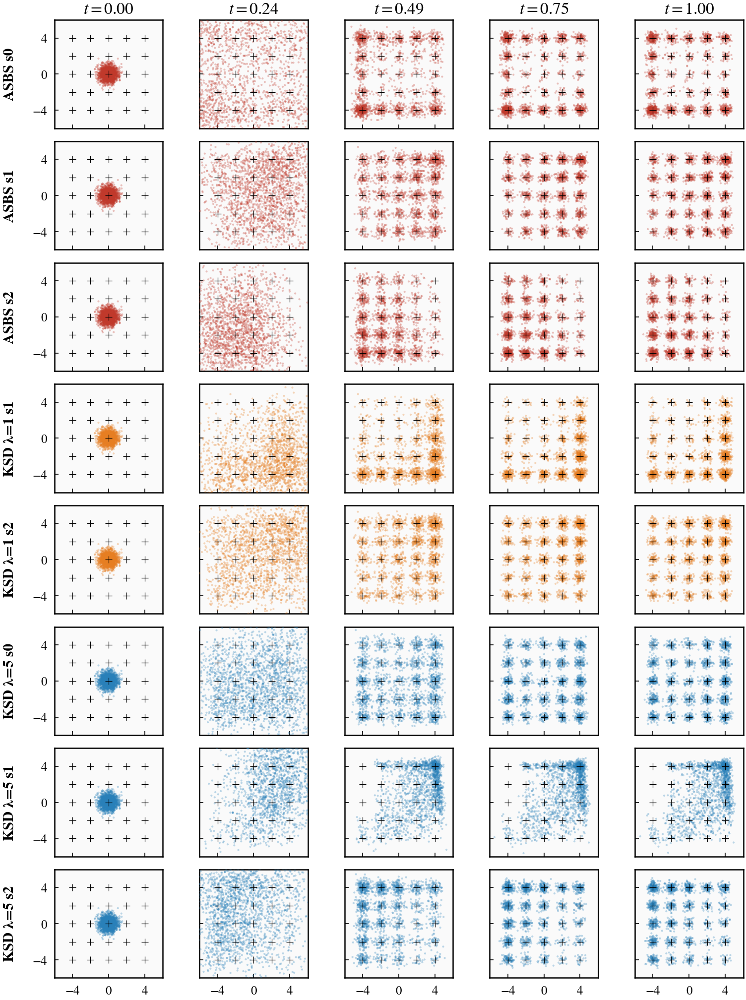
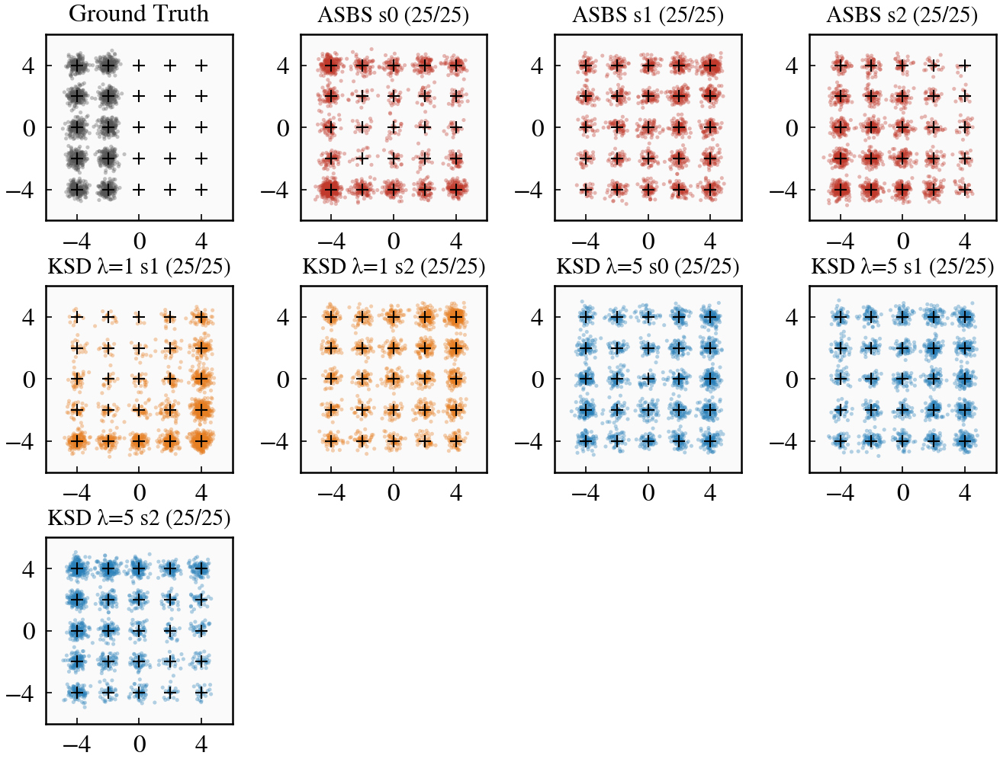
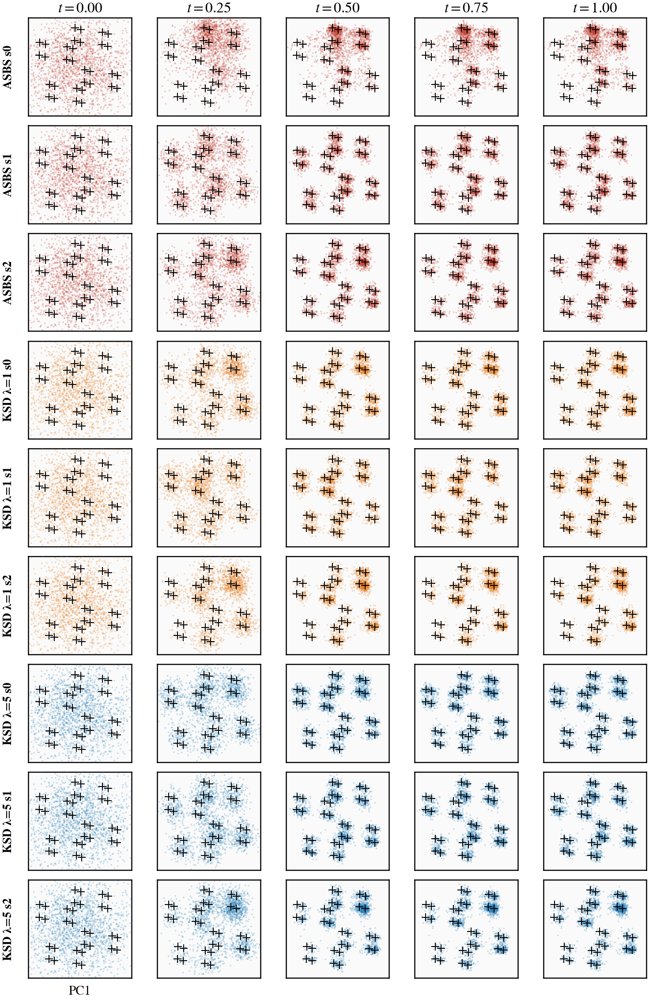
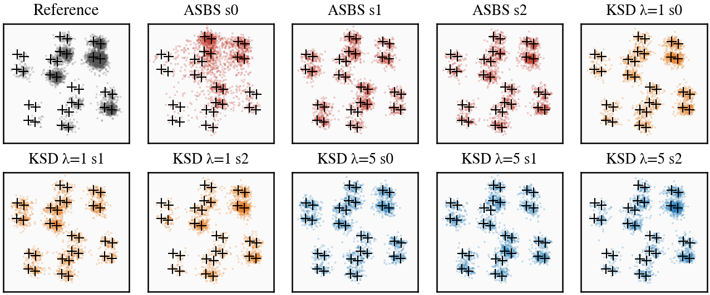
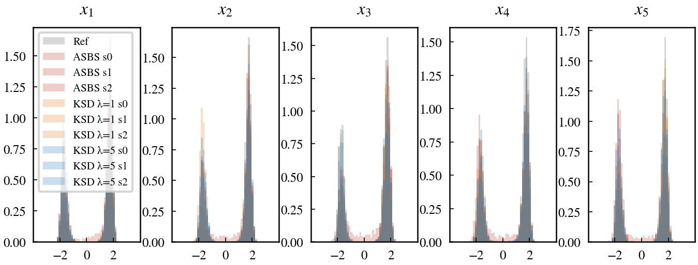

# Results v2: Grid25 and MW5 Benchmarks

All experiments trained for 5000 epochs. Diverged runs were retrained with `clip_target_norm=200.0` and `clip_grad_norm=1.0`. Metrics computed on 2000 generated samples against 5000 reference samples.

---

## Grid25 (5x5 Gaussian Mixture, 2D)

### Metrics

| Experiment | Modes | W2 | Sinkhorn | Weight TV | E_mean |
|---|---|---|---|---|---|
| ASBS s0 | 25/25 | 1.877 | 3.483 | 0.326 | 1.107 |
| ASBS s1 | 25/25 | 1.327 | 1.803 | 0.144 | 1.024 |
| ASBS s2 | 25/25 | 2.128 | 4.504 | 0.274 | 1.007 |
| KSD lambda=1 s1 | 25/25 | 2.906 | 8.336 | 0.417 | 1.070 |
| KSD lambda=1 s2 | 25/25 | 1.558 | 2.459 | 0.185 | 1.026 |
| **KSD lambda=5 s0** | **25/25** | **0.808** | **0.718** | **0.137** | 1.090 |
| KSD lambda=5 s1 | 25/25 | 1.113 | 1.309 | 0.147 | 1.014 |
| KSD lambda=5 s2 | 25/25 | 1.934 | 3.734 | 0.259 | 1.071 |

### Aggregated (mean +/- std across seeds)

| Method | W2 | Sinkhorn | Weight TV |
|---|---|---|---|
| ASBS (3 seeds) | 1.777 +/- 0.333 | 3.264 +/- 1.104 | 0.248 +/- 0.076 |
| KSD lambda=1 (2 seeds) | 2.232 +/- 0.674 | 5.397 +/- 2.939 | 0.301 +/- 0.116 |
| **KSD lambda=5 (3 seeds)** | **1.285 +/- 0.469** | **1.921 +/- 1.294** | **0.181 +/- 0.053** |

### Marginal Evolution (2D scatter, t=0.00 to t=1.00)

### Terminal Distribution

---

## MW5 (5D Many-Well, 32 modes)

### Metrics

| Experiment | Modes | W2 | Sinkhorn | Weight TV | mean W1 | E_mean |
|---|---|---|---|---|---|---|
| ASBS s0 | 32/32 | 3.254 | 10.625 | 0.436 | 0.818 | -39.791 |
| ASBS s1 | 32/32 | 3.732 | 13.957 | 0.229 | 0.990 | -42.825 |
| ASBS s2 | 32/32 | 2.908 | 8.503 | 0.283 | 0.647 | -43.600 |
| KSD lambda=1 s0 | 32/32 | 3.244 | 10.567 | 0.254 | 0.776 | -43.340 |
| KSD lambda=1 s1 | 32/32 | 3.589 | 12.912 | 0.232 | 0.934 | -42.806 |
| KSD lambda=1 s2 | 32/32 | 2.277 | 5.259 | 0.416 | 0.416 | -44.176 |
| KSD lambda=5 s0 | 32/32 | 3.687 | 13.626 | **0.141** | 0.976 | -42.820 |
| KSD lambda=5 s1 | 32/32 | 3.700 | 13.726 | 0.198 | 0.977 | -42.805 |
| KSD lambda=5 s2 | 32/32 | 2.356 | 5.617 | 0.375 | 0.447 | -44.095 |

### Aggregated (mean +/- std across seeds)

| Method | W2 | Sinkhorn | Weight TV | mean W1 |
|---|---|---|---|---|
| ASBS (3 seeds) | 3.298 +/- 0.339 | 11.028 +/- 2.262 | 0.316 +/- 0.087 | 0.818 +/- 0.140 |
| KSD lambda=1 (3 seeds) | 3.037 +/- 0.556 | 9.579 +/- 3.239 | 0.300 +/- 0.083 | 0.708 +/- 0.218 |
| **KSD lambda=5 (3 seeds)** | 3.248 +/- 0.621 | 10.990 +/- 3.757 | **0.238 +/- 0.098** | 0.800 +/- 0.249 |

### PCA Marginal Evolution (5D projected to 2D, t=0.00 to t=1.00)

All 32 mode centers shown as black `+` markers. PCA fit on reference samples.

### PCA Terminal Distribution

### Per-Dimension Terminal Marginals

---

## Unequal-Weight GMM (5 modes, 2D)

Target weights: [0.50, 0.25, 0.15, 0.07, 0.03]. Trained for 5000 epochs, no gradient clipping.

**Diverged runs (excluded):** ASBS seed 0 (NaN), KSD λ=1.0 all 3 seeds (NaN or exploded to ~15k loss).

### Metrics (checkpoint_latest, epoch 4900)

| Experiment | Modes | W2 | Weight TV | Weight KL | Minority (3%) | E_mean |
|---|---|---|---|---|---|---|
| ASBS s1 | 5/5 | 3.181 | 0.3135 | 0.2827 | 0.1610 | 2.942 |
| ASBS s2 | 1/5 | 4.879 | 0.5000 | 10.2439 | 0.0000 | 1.703 |
| KSD λ=5 s0 | 2/5 | 7.219 | 0.7800 | 16.8489 | 0.0000 | 3.377 |
| KSD λ=5 s1 | 1/5 | 5.231 | 0.7500 | 16.0003 | 0.0000 | 2.372 |
| KSD λ=5 s2 | 2/5 | 6.565 | 0.9000 | 19.5223 | 0.4840 | 4.092 |

### Aggregated (mean +/- std, latest checkpoint)

| Method | Modes | W2 | Weight TV | Weight KL | Minority wt |
|---|---|---|---|---|---|
| ASBS (2 seeds) | 3.0 | 4.030 +/- 0.849 | 0.4067 +/- 0.0932 | 5.2633 +/- 4.9806 | 0.0805 +/- 0.0805 |
| KSD λ=5 (3 seeds) | 1.7 | 6.338 +/- 0.827 | 0.8100 +/- 0.0648 | 17.4572 +/- 1.5008 | 0.1613 +/- 0.2282 |

### Best Checkpoint Selection (via epoch sweep)

Checkpoint sweep over epochs {500, 1000, ..., 4900} reveals that:
- **ASBS s1** peaks at **epoch 3100** (5/5 modes, TV=0.194, KL=0.089, W2=1.713) then degrades
- **ASBS s2** is stuck at 1/5 modes from epoch 500 through 4900 (full mode collapse to mode 0)
- **KSD λ=5 all seeds** never exceed 2/5 modes across all checkpoints — persistent mode collapse

| Experiment (best ckpt) | Epoch | Modes | W2 | Weight TV | Weight KL | Minority (3%) | E_mean |
|---|---|---|---|---|---|---|---|
| **ASBS s1** | **3100** | **5/5** | **1.713** | **0.1940** | **0.0888** | **0.0560** | 2.427 |
| ASBS s2 | 4900 | 1/5 | 4.879 | 0.5000 | 10.2439 | 0.0000 | 1.703 |
| KSD λ=5 s0 | 4900 | 2/5 | 7.219 | 0.7800 | 16.8489 | 0.0000 | 3.377 |
| KSD λ=5 s1 | 4900 | 1/5 | 5.231 | 0.7500 | 16.0003 | 0.0000 | 2.372 |
| KSD λ=5 s2 | 4900 | 2/5 | 6.565 | 0.9000 | 19.5223 | 0.4840 | 4.092 |

### Notes

- **KSD λ=1.0 is completely unstable** on this benchmark: all 3 seeds diverged (2 to NaN, 1 exploded to loss ~15k).
- **KSD λ=5.0 shows persistent mode collapse** on these seeds, unlike the prior single-seed eval (from another server, seed 0) which recovered all 5 modes. This suggests high seed sensitivity.
- **Baseline ASBS s1 is the only run to recover all 5 modes**, and only at an intermediate checkpoint (ep 2700–3500). Overtraining causes degradation.
- The unequal-weight GMM appears to be a high-variance benchmark where mode coverage is extremely seed-dependent.

---

## Key Findings

1. **Grid25:** KSD lambda=5 is the clear winner with the best W2 (0.808), Sinkhorn (0.718), and weight TV (0.137) in its best seed, and the best aggregated metrics across all 3 seeds.

2. **MW5:** All methods achieve 32/32 mode coverage (with clipping). KSD lambda=5 achieves the best (lowest) weight TV (0.238 mean), indicating the most uniform distribution of samples across all 32 modes. KSD lambda=1 has the best W2 and Sinkhorn on average, driven by seed 2.

3. **Training stability:** MW5 is prone to transient loss spikes across all methods. Gradient clipping (`clip_grad_norm=1.0`) and target clipping (`clip_target_norm=200.0`) are essential for reliable convergence. Without clipping, 7/18 MW5+Grid25 runs diverged; with clipping, all recovered.

4. **KSD effect on mode uniformity:** The KSD penalty consistently improves weight TV (mode balance) at higher lambda. At lambda=5, MW5 weight TV drops from 0.316 (ASBS) to 0.238 (KSD), a 25% improvement in mode coverage uniformity.

5. **Unequal-Weight GMM:** This benchmark is highly seed-sensitive. KSD λ=1.0 is completely unstable (all 3 seeds diverged). KSD λ=5.0 shows persistent mode collapse on all 3 seeds (1–2 modes only), contradicting the prior single-seed result. Baseline ASBS s1 is the only run to recover all 5 modes (at ep 3100: TV=0.194, KL=0.089), but overtraining degrades it. ASBS s2 and all KSD seeds mode-collapse from the start. This suggests the unequal-weight GMM needs either more seeds, gradient clipping, or a different λ schedule to achieve reliable mode recovery.
